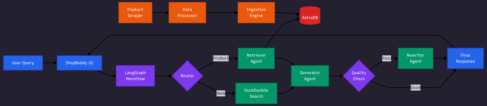
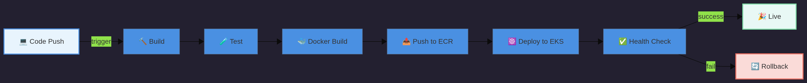

# <div align="center">🛍️ ShopBuddy</div>

<div align="center">

### *Your Intelligent E-Commerce Companion*

[](https://www.python.org/downloads/)
[](https://www.docker.com/)
[](https://kubernetes.io/)
[](https://aws.amazon.com/)
[](https://github.com/langchain-ai/langchain)
[](LICENSE)


*Combining web scraping, vector databases, and agentic RAG workflows to deliver intelligent product insights*

[Features](#-features) • [Architecture](#-architecture) • [Installation](#-installation) • [Deployment](#️-deployment) • [Documentation](#-project-structure)

---

</div>

## 🌟 Overview

**ShopBuddy** is a sophisticated AI-powered e-commerce assistant that revolutionizes how users interact with product information. By leveraging cutting-edge LangGraph agentic workflows, vector databases, and hybrid retrieval mechanisms, it provides intelligent, context-aware responses to product queries.

<div align="center">

| 🎯 **Smart Retrieval** | 🤖 **AI-Powered** | 🔍 **Hybrid Search** | ☁️ **Cloud Native** |
|:---:|:---:|:---:|:---:|
| AstraDB Vector Search | Groq + Google LLMs | Database + Web | AWS EKS Deployed |

</div>

### 💡 What Makes ShopBuddy Special?

```
┌──────────────────────────────────────────────────────────────────┐
│  🎨 Conversational UI  →  🧠 Agentic Workflow  →  📊 Smart Data  |
│                                                                  │
│  Natural Language  →  Multi-Agent Processing  →  Accurate Results│
└──────────────────────────────────────────────────────────────────┘
```

**Database Architecture:**
- 🗄️ Database: `prod_assistant_db`
- 📦 Collection: `ecommercedata`
- 🌐 Hybrid Retrieval: Vector DB + Web Search

---

## ✨ Features

<table>
<tr>
<td width="50%">

### 🤖 **Intelligent Agents**
- Multi-node LangGraph workflow
- Assistant, Retriever, Generator agents
- Dynamic Rewriter for quality control
- Conditional routing logic

</td>
<td width="50%">

### 🔍 **Hybrid Retrieval**
- AstraDB vector search
- DuckDuckGo web integration
- Real-time product data
- Contextual understanding

</td>
</tr>
<tr>
<td width="50%">

### 📊 **Data Pipeline**
- Automated Flipkart scraping
- Structured data ingestion
- Vector embeddings storage
- CSV export capabilities

</td>
<td width="50%">

### 🎨 **User Experience**
- Clean chat interface
- Real-time responses
- Natural language queries
- Mobile-responsive design

</td>
</tr>
<tr>
<td width="50%">

### ☁️ **Production Ready**
- Docker containerization
- Kubernetes orchestration
- AWS EKS deployment
- GitHub Actions CI/CD

</td>
<td width="50%">

### 📈 **Quality Assurance**
- RAGAS evaluation framework
- Multiple quality metrics
- Performance monitoring
- Continuous improvement

</td>
</tr>
</table>

---

## 🏗️ Architecture

<div align="center">

### *System Architecture & Data Flow*



</div>

### 🔄 Workflow Components

<table>
<tr>
<td width="33%">

#### 📥 **ETL Pipeline**
```
🕷️ Scraper
    ↓
⚙️ Processor
    ↓
📥 Ingestion
    ↓
🗄️ AstraDB
```

</td>
<td width="33%">

#### 🧠 **Agent System**
```
  🎯 Router
   ↙️     ↘️
📚         🌐
Retriever  Search
   ↘️      ↙️
       ✍️
    Generator
```

</td>
<td width="33%">

#### ✨ **Quality Control**
```
✍️ Response
    ↓
✨ Validate
   ↙️  ↘️
 ✅       🔄
Good    Rewrite
```

</td>
</tr>
</table>

---

## 🛠️ Tech Stack

<div align="center">

### *Built with Best-in-Class Technologies*

</div>

<table>
<tr>
<td width="50%" valign="top">

### 🧠 **AI & ML**
```yaml
Framework:     LangGraph, LangChain
LLM Providers: Groq, Google AI
Embeddings:    Google
Orchestration: Multi-Agent Workflow
Evaluation:    RAGAS Framework
```

### 💾 **Data & Storage**
```yaml
Vector DB:     DataStax AstraDB
File Format:   CSV, JSON
Processing:    Pandas, NumPy
Web Scraping:  BeautifulSoup, Selenium
Search:        DuckDuckGo API
```

</td>
<td width="50%" valign="top">

### 🌐 **Web & API**
```yaml
Backend:       FastAPI
Templates:     Jinja2
Frontend:      HTML5, CSS3, JavaScript
API Design:    RESTful
Framework:     ASGI (Uvicorn)
```

### ☁️ **DevOps & Cloud**
```yaml
Containers:    Docker
Orchestration: Kubernetes (K8s)
Cloud:         AWS EKS, ECR
CI/CD:         GitHub Actions
IaC:           YAML Configurations
```

</td>
</tr>
</table>

---

## 📁 Project Structure

<div align="center">

*Clean, modular, and production-ready organization*

</div>

```
ecomm-prod-assistant/
│
├── 🔧 .github/workflows/          # CI/CD Automation
│   ├── deploy.yml                 # Deployment pipeline
│   └── infra.yml                  # Infrastructure setup
│
├── 📊 data/                        # Data Storage
│   └── product_reviews.csv        # Scraped product data
│
├── ☁️ infra/                       # Infrastructure as Code
│   └── eks-with-ecr.yaml          # AWS EKS configuration
│
├── ⚙️ k8/                          # Kubernetes Manifests
│   ├── deployment.yaml            # K8s deployment specs
│   └── service.yaml               # K8s service config
│
├── 🎯 prod_assistant/              # Core Application
│   │
│   ├── 🔧 config/                 # Configuration Management
│   │   └── config.yaml            # App settings
│   │
│   ├── 📥 etl/                    # Extract, Transform, Load
│   │   ├── data_scrapper.py       # Flipkart scraper
│   │   └── data_ingestion.py      # AstraDB ingestion
│   │
│   ├── 📊 evaluation/             # Quality Metrics
│   │   └── ragas_eval.py          # RAGAS evaluation
│   │
│   ├── ⚠️ exception/              # Error Handling
│   │   └── custom_exception.py    # Custom exceptions
│   │
│   ├── 📝 logger/                 # Logging System
│   │   └── custom_logger.py       # Logging utilities
│   │
│   ├── 🖥️ mcp_servers/            # MCP Implementation
│   │   ├── product_search_server.py
│   │   ├── rag_server.py
│   │   └── client.py
│   │
│   ├── 💬 prompt_library/         # Prompt Engineering
│   │   └── prompts.py             # Optimized prompts
│   │
│   ├── 🔍 retriever/              # Retrieval Logic
│   │   └── retrieval.py           # Vector search
│   │
│   ├── 🌐 router/                 # API Endpoints
│   │   └── main.py                # Flask application
│   │
│   ├── 🛠️ utils/                  # Utility Functions
│   │   ├── config_loader.py       # Config management
│   │   └── model_loader.py        # Model initialization
│   │
│   └── 🤖 workflow/               # Agentic Workflows
│       ├── agentic_rag_workflow.py
│       ├── agentic_workflow_with_mcp.py
│       ├── agentic_workflow_with_mcp_websearch.py
│       └── normal_generation_workflow.py
│
├── 🎨 static/                      # Static Assets
│   ├── style.css                  # Styling
│   └── logo.png                   # Brand assets
│
├── 📄 templates/                   # HTML Templates
│   └── chat.html                  # Chat interface
│
├── 🧪 test/                        # Testing
│   └── test.py                    # Test suites
│
├── 🐳 Dockerfile                   # Container definition
├── 📦 requirements.txt             # Python dependencies
├── 📋 pyproject.toml              # Project metadata
├── 🕷️ scrapper_ui.py              # Scraper interface
└── 📖 README.md                    # Documentation
```

---

## 🚀 Installation

### 📋 Prerequisites

<table>
<tr>
<td>

**Required:**
- ✅ Python 3.11+
- ✅ uv or pip
- ✅ AstraDB account
- ✅ Groq API key

</td>
<td>

**Optional:**
- 🐳 Docker
- ☸️ Kubernetes CLI
- ☁️ AWS CLI
- 🔑 Google AI key

</td>
</tr>
</table>

### 🔧 Local Setup

<details>
<summary><b>📥 Step 1: Clone Repository</b></summary>

```bash
git clone https://github.com/Krishna-Thakkar/ecomm-prod-assistant.git
cd ecomm-prod-assistant
```
</details>

<details>
<summary><b>🐍 Step 2: Create Virtual Environment</b></summary>

```bash
# Create environment
python -m venv venv

# Activate (Linux/Mac)
source venv/bin/activate

# Activate (Windows)
venv\Scripts\activate
```
</details>

<details>
<summary><b>📦 Step 3: Install Dependencies</b></summary>

```bash
pip install -r requirements.txt
```
</details>

<details>
<summary><b>🔑 Step 4: Configure Environment</b></summary>

Create `.env` file:
```env
# Database Configuration
ASTRA_DB_TOKEN=your_astra_token_here
ASTRA_DB_ENDPOINT=your_astra_endpoint_here

# LLM API Keys
GROQ_API_KEY=your_groq_key_here
GOOGLE_API_KEY=your_google_key_here
```
</details>

<details>
<summary><b>⚙️ Step 5: Configure Application</b></summary>

Edit `prod_assistant/config/config.yaml`:
```yaml
database:
  name: prod_assistant_db
  collection: ecommercedata
  
models:
  primary: groq
  fallback: google
  temperature: 0.7
  
retrieval:
  top_k: 5
  similarity_threshold: 0.7
```
</details>

---

## ⚙️ Configuration

### 🗄️ AstraDB Setup

```
┌─────────────────────────────────────┐
│  1. Create Database                 │
│     Name: prod_assistant_db         │
│                                     │
│  2. Create Collection               │
│     Name: ecommercedata             │
│     Dimensions: 1536 (OpenAI)       │
│                                     │
│  3. Get Credentials                 │
│     - API Token                     │
│     - Database Endpoint             │
│                                     │
│  4. Update .env file                │
└─────────────────────────────────────┘
```

### 🤖 Model Configuration

<table>
<tr>
<td width="50%">

#### **Groq (Primary)**
- ⚡ Ultra-fast inference
- 💬 Chat completions
- 🎯 Quick responses
- 💰 Cost-effective

</td>
<td width="50%">

#### **Google AI (Fallback)**
- 🧠 Complex reasoning
- 📚 Long context
- 🎨 Creative tasks
- 🔄 Redundancy

</td>
</tr>
</table>

---

## 💻 Usage

### 🌐 Running ShopBuddy

```bash
# Start the FastAPI application
uvicorn prod_assistant.router.main:app --reload --port 8000

# Server will start at
http://localhost:8000
```

<div align="center">

**🎉 ShopBuddy is now running! Open your browser and start chatting!**

</div>

### 📊 Data Pipeline Operations

<table>
<tr>
<td width="100%" colspan="2">

#### **🕷️ Scrape Product Data with Streamlit UI**

```bash
# Run the scraper interface
streamlit run scrapper_ui.py
```

**Using the Scraper UI:**
1. Enter product name (e.g., "iPhone 16")
2. Set number of products per search
3. Set number of reviews per product
4. Click "🔧 Start Scraping"
5. Once complete:
   - Click "📥 Download CSV" to save data locally
   - Click "💾 Store in Vector DB (AstraDB)" to ingest into database

</td>
</tr>
</table>

### 💬 Example Interactions

```
User: "What is the price of iPhone 16?"
🤖 ShopBuddy: Searching products and web...

User: "Compare Samsung Galaxy S24 with iPhone 15"
🤖 ShopBuddy: Retrieving specifications...
```

### 🐳 Docker Usage

<details>
<summary><b>Click to expand Docker commands</b></summary>

```bash
# Build image
docker build -t shopbuddy:latest .

# Run container
docker run -p 5000:5000 \
  --env-file .env \
  --name shopbuddy \
  shopbuddy:latest

# View logs
docker logs -f shopbuddy

# Stop container
docker stop shopbuddy
```
</details>

---

## ☁️ Deployment

<div align="center">

### *Production Deployment on AWS*

</div>

### 🏗️ Infrastructure Setup

```bash
# Create EKS cluster
kubectl apply -f infra/eks-with-ecr.yaml

# Verify cluster
kubectl cluster-info
```

### ☸️ Kubernetes Deployment

<table>
<tr>
<td width="50%">

#### **Deploy Application**
```bash
kubectl apply -f k8/deployment.yaml
```

#### **Expose Service**
```bash
kubectl apply -f k8/service.yaml
```

</td>
<td width="50%">

#### **Check Status**
```bash
kubectl get pods
kubectl get services
kubectl describe deployment shopbuddy
```

#### **View Logs**
```bash
kubectl logs -f deployment/shopbuddy
```

</td>
</tr>
</table>

### 🔄 CI/CD Pipeline

<div align="center">

### *CI/CD Pipeline*



</div>


**Automated Workflows:**
1. **Infrastructure** (`.github/workflows/infra.yml`) - Sets up AWS resources
2. **Deployment** (`.github/workflows/deploy.yml`) - Builds and deploys application

**Trigger Deployment:**
```bash
git add .
git commit -m "feat: add new feature"
git push origin main
```

---

## 🤝 Contributing

<div align="center">

**We welcome contributions from the community!**

</div>

### 🌟 How to Contribute

```
1️⃣ Fork → 2️⃣ Branch → 3️⃣ Code → 4️⃣ Test → 5️⃣ PR
```

<details>
<summary><b>📝 Detailed Steps</b></summary>

1. **Fork the repository**
   ```bash
   # Click 'Fork' on GitHub
   ```

2. **Create feature branch**
   ```bash
   git checkout -b feature/AmazingFeature
   ```

3. **Make your changes**
   ```bash
   # Write code, add tests
   ```

4. **Commit changes**
   ```bash
   git commit -m "feat: add amazing feature"
   ```

5. **Push to branch**
   ```bash
   git push origin feature/AmazingFeature
   ```

6. **Open Pull Request**
   ```bash
   # Create PR on GitHub
   ```
</details>

### 📜 Development Guidelines

- ✅ Follow PEP 8 style guide
- ✅ Write comprehensive tests
- ✅ Update documentation
- ✅ Use meaningful commit messages
- ✅ Add comments for complex logic

---

## 📝 License

<div align="center">

This project is licensed under the **MIT License**

See [LICENSE](LICENSE) file for details

*Free to use, modify, and distribute*

</div>

---

## 📧 Contact

<div align="center">

### **Krishna Thakkar**

[](https://github.com/Krishna-Thakkar)
[](https://github.com/Krishna-Thakkar/ecomm-prod-assistant)

</div>

---

## 🙏 Acknowledgments

<div align="center">

Special thanks to the amazing open-source community

</div>

<table>
<tr>
<td align="center" width="25%">

**🦜 LangGraph**

Agentic workflow framework

</td>
<td align="center" width="25%">

**💾 AstraDB**

Vector database excellence

</td>
<td align="center" width="25%">

**⚡ Groq**

Lightning-fast inference

</td>
<td align="center" width="25%">

**📊 RAGAS**

RAG evaluation framework

</td>
</tr>
</table>

---

<div align="center">

### ⭐ **Star this repo if you find it helpful!** ⭐

**Made with ❤️ and ☕ by Krishna Thakkar**

---

*ShopBuddy - Making E-Commerce Smarter, One Query at a Time* 🚀

</div>